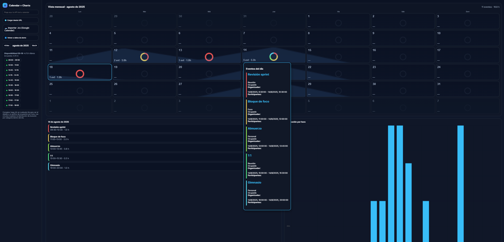

# 📅 Mi Calendar

Visualizador de calendario avanzado con gráficos interactivos y análisis de carga horaria semanal.

## Funcionalidades principales

- **Visualización mensual**: Muestra el calendario completo del mes, con cada día representado como una tarjeta interactiva.
- **Gráficos de área semanales**: Cada fila semanal muestra un gráfico de área continuo y suave, donde cada tarjeta de día refleja su parte de la curva semanal de carga horaria.
- **Gráficos circulares por día**: Visualización de la distribución de eventos por categoría dentro de cada día usando Chart.js.
- **Detalle de eventos**: Al hacer clic en un día, se despliega un popup con todos los eventos ordenados por horario, mostrando participantes, organizador, descripción y enlaces de videollamada si existen.
- **Importación desde endpoint JSON o archivo ICS**: Permite cargar eventos desde una URL pública (Google Calendar API) o importar archivos .ics.
- **Animación de carga**: Spinner animado mientras se descargan los datos.
- **Colores dinámicos**: Cada categoría de evento tiene un color único y vibrante.
- **Estadísticas mensuales**: Muestra el total de eventos y horas ocupadas en el mes.
- **Responsive y moderno**: Interfaz adaptada a dispositivos móviles y escritorio, con diseño oscuro y tipografía moderna.

## Cómo usar

1. Clona el repositorio:
   ```sh
   git clone https://github.com/elgitdemarce/mi-calendar.git
   ```
2. Abre el archivo `public/calendar con endpoint.html` en tu navegador.
3. Ingresa la URL pública de tu calendario (JSON) o importa un archivo `.ics`.
4. Explora el calendario, haz clic en cualquier día para ver detalles y gráficos.

## Ejemplo visual



## Tecnologías utilizadas

- HTML5, CSS3, JavaScript
- [Chart.js](https://www.chartjs.org/) para gráficos
- Google Calendar API (para endpoints JSON)

## Autor

Creado por [@elgitdemarce](https://github.com/elgitdemarce)

---
¡Disfruta visualizando y analizando tus eventos como nunca antes! 🚀
